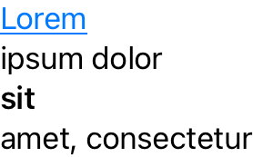

# TextBuilder


## Introduction

`Text` composition in SwiftUI can often be cumbersome, especially when there's logic affecting its format and content.

TextBuilder leverages the power of Swift [Result Builders](https://github.com/apple/swift-evolution/blob/main/proposals/0289-result-builders.md) to solve this problem. TextBuilder mimics SwiftUI's [ViewBuilder](https://developer.apple.com/documentation/swiftui/viewbuilder) to make for a familiar experience at the point of use.

## Usage

TextBuilder offers 3 ready-made builders out of the box, depending on which text separator you need.

### Unspaced Text

```swift
@BasicTextBuilder
var loremIpsum: Text {
    Text("Lorem").underline().foregroundColor(.blue)
    Text("ipsum dolor")
    Text("sit").bold()
    Text("amet, consectetur")
}
```


### Spaced Text

```swift
@SpacedTextBuilder
var loremIpsum: Text {
    Text("Lorem").underline().foregroundColor(.blue)
    Text("ipsum dolor")
    Text("sit").bold()
    Text("amet, consectetur")
}
```


### Multiline Text

```swift
@MultilineTextBuilder
var loremIpsum: Text {
    Text("Lorem").underline().foregroundColor(.blue)
    Text("ipsum dolor")
    Text("sit").bold()
    Text("amet, consectetur")
}
```



### Other Separators

There are two options to customize the separator used to compose your `Text`.

First, you can use `Text.init(separator:content:)`:

```swift
var loremIpsum: Text {
    Text(separator: " 🍆 ") {
        Text("Lorem").underline().foregroundColor(.blue)
        Text("ipsum dolor")
        Text("sit").bold()
        Text("amet, consectetur")
    }
}
```

But if you prefer to keep using a result builder, you can:

```swift
struct EggplantSeparator: TextBuilderSeparator {
    static var separator: String { " 🍆 " }
}

@TextBuilder<EggplantSeparator>
var loremIpsum: Text {
    Text("Lorem").underline().foregroundColor(.blue)
    Text("ipsum dolor")
    Text("sit").bold()
    Text("amet, consectetur")
}
```


### Pro-tip

TextBuilder accepts `String` types directly as if they were plain `Text`, and also provides a `String.text` computed var to remove unwanted code noise when `Text` is explicitly needed.

```swift
@MultilineTextBuilder
var loremIpsum: Text {
    "Lorem".text.underline().foregroundColor(.blue)
    "ipsum dolor"
    "sit".text.bold()
    "amet, consectetur"
}
```

## Try it out!

TextBuilder supports [Arena](https://github.com/finestructure/Arena) to effortlessly test this library in a playground before you decide to take it for a spin in your own project.

Simply [install Arena](https://github.com/finestructure/Arena#how-to-install-arena) and run `arena davdroman/TextBuilder --platform macos` in your terminal.